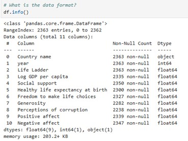
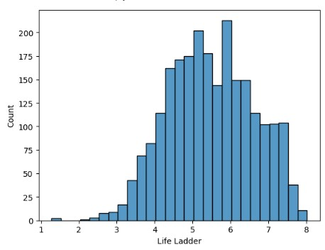
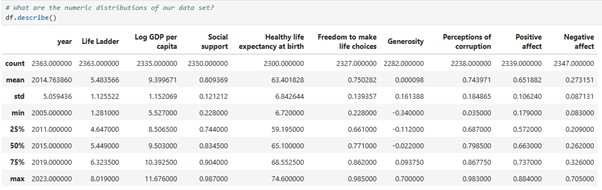

# Can Money Buy Happiness?
## An exploration of World Happiness data

## Executive Summary
This project provides an analysis of world happiness data to identify the key factors that drive a population's happiness levels.
Using a publicly available dataset to allow the project to be published on a portfolio web site, exploratory data analysis and appropriate data cleansing was undertaken, prior to building a linear regression model in Python to predict a nations happiness scores based on selected variables. The key variables identified as influencing the happiness rating were GDP per capita, social support and healthy life expectancy. 
Results of the data analysed show that the most influential factor on a nations happiness is the level of social support available to the population, although money does have some influence as well. These results could prove useful to guide government policies to improve national satisfaction.
The analysis conducted has limitations – a certain amount of data was missing and had to be excluded from the analysis. This resulted in a disproportionate number of entries for two years being removed from the modelling process. Additionally, all variables exhibited several outlying values. Both factors could have skewed the results, although the model accuracy of 71% (measured by R-squared) is satisfactory.

## Project Background
The aim of this project was to undertake a simple regression modelling exercise that could be shared on a public portfolio website and be useful to novice data scientists. After several data options were assessed, a dataset of world happiness data was located, which appeared to fulfil the criteria. 

## Methods
### Data Collection
The data set used for analysis is the Gallup World Happiness Report. A consolidated data set of all the annual results is available on Kaggle. In addition to containing the happiness score by country, this data set also includes several numeric data points capturing factors that may influence a population’s happiness. This makes it a good candidate for a linear regression analysis, to identify if any of these variables correlate with the population overall happiness, and if so in what way.

### Data Transformation
Exploratory data analysis was undertaken in Python – a tool well suited to this task due to its strengths in data analysis and predictive modelling. The data set was loaded into Python and assessed for format and numeric distribution. The image below shows all the fields contained within the data set, and confirms that all data is numeric, as expected, apart from the country name.

The distribution of the Life Ladder score (the happiness index) shows a mostly normal distribution, skewed to the right.

Initial analysis of the numeric distributions of the data fields revealed the spread of the data covers the years 2005 to 2023, and shows the range of values for all the variables. It also highlighted that there were several blank entries for each of the variables.

## References
1. [World Happiness Report](https://worldhappiness.report/)
2. [World Happiness Data on Kaggle](https://www.kaggle.com/datasets/jainaru/world-happiness-report-2024-yearly-updated)
