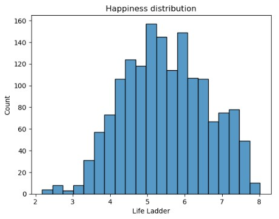
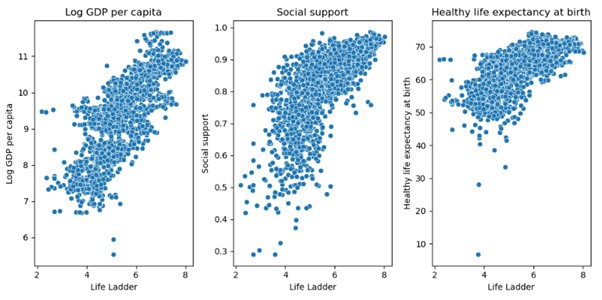
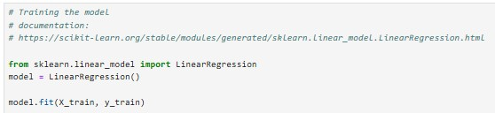
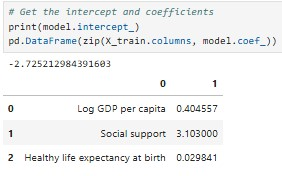
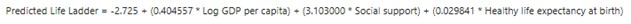
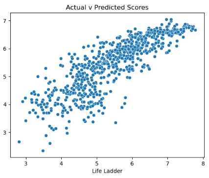
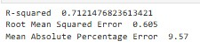

# Can Money Buy Happiness?
### An exploration of World Happiness data

## Executive Summary
This project provides an analysis of world happiness data to identify the key factors that drive a population's happiness levels.
Using a publicly available dataset to allow the project to be published on a portfolio web site, exploratory data analysis and appropriate data cleansing was undertaken, prior to building a linear regression model in Python to predict a nations happiness scores based on selected variables. The key variables identified as influencing the happiness rating were GDP per capita, social support and healthy life expectancy. 
Results of the data analysed show that the most influential factor on a nations happiness is the level of social support available to the population, although money does have some influence as well. These results could prove useful to guide government policies to improve national satisfaction.
The analysis conducted has limitations – a certain amount of data was missing and had to be excluded from the analysis. This resulted in a disproportionate number of entries for two years being removed from the modelling process. Additionally, all variables exhibited several outlying values. Both factors could have skewed the results, although the model accuracy of 71% (measured by R-squared) is satisfactory.

## Project Background
The aim of this project was to undertake a simple regression modelling exercise that could be shared on a public portfolio website and be useful to novice data scientists. After several data options were assessed, a dataset of world happiness data was located, which appeared to fulfil the criteria. 

## Methods
### Data Collection
The data set used for analysis is the Gallup World Happiness Report. A consolidated data set of all the annual results is available on Kaggle. In addition to containing the happiness score by country, this data set also includes several numeric data points capturing factors that may influence a population’s happiness. This makes it a good candidate for a linear regression analysis, to identify if any of these variables correlate with the population overall happiness, and if so in what way.

### Data Transformation
Exploratory data analysis was undertaken in Python – a tool well suited to this task due to its strengths in data analysis and predictive modelling. The data set was loaded into Python and assessed for format and numeric distribution. The image below shows all the fields contained within the data set, and confirms that all data is numeric, as expected, apart from the country name.

The distribution of the Life Ladder score (the happiness index) shows a mostly normal distribution, skewed to the right.

Initial analysis of the numeric distributions of the data fields revealed the spread of the data covers the years 2005 to 2023, and shows the range of values for all the variables. It also highlighted that there were several blank entries for each of the variables.

The entries with any missing data were split into a separate data frame.

First, it was identified that there were 10 countries in the data set with at least one missing value for every line of data held. With no complete data for these countries for any year, these countries could skew the analysis and so they were removed from the data set.

Given that there were different numbers of missing items for each data field, the decision was made to proceed with the analysis using the data set with all missing entries removed. To validate this as an approach, the total entries by year for each data set was compared, to test for similar distribution.

As the image below shows, the overall distribution remained mostly comparable, although inconsistencies in 2005 and 2023 were observed where it appeared proportionally more entries had been removed. The decision was made to proceed with the regression model on the non-null data set, but a potential future enhancement to the project could be to remove the 2005 and 2023 data to test whether different results were observed.

Box and whisker plots show the inter-quartile range and can make it very easy to observe outliers which might skew the results. As the image below shows, all variables showed some outliers, with Log GDP per capita having the fewest – a future enhancement for this project could be to further analyse these and potentially remove them.

To investigate whether there was a correlation between the variables a heatmap was used - the lighter the colour, the stronger the correlation. The image below shows that Log GDP per capita, Social support and Healthy life expectancy had the strongest correlations to the Life Ladder rating. 

Given the strong correlations of those three variables, the others were removed from the data set for analysis. This was done based on the complete data set, including null values, and after narrowing down the variables, null values were removed. This was done to ensure the data analysis was undertaken on the most complete set of data available. Correlation between independent variables and target variable in the final data set confirms that the correlation remains above 0.7 for each variable after the removal of null values.

### Data Analysis
The final transformed data set was split into two – 70% as a train set and 30% as a test set – for linear regression analysis. The distribution of the Life Ladder score in the train set was compared to that for the full data set distribution to confirm it was representative, and it was observed to so be.

Plotting each of the independent variables in the train set against the target variable shows that all three show a positive correlation.

The linear regression modelling library from the Python library scikit-learn was used to build the predictive model for how each of these three variables influences the target variable. The image below shows the code to train the model.

The results of this analysis are shown below:

The linear regression analysis predicts both the intercept (where a straight line joining all the points will cross the y axis) and the multipliers for each of the independent variables. Putting these together gives us the formula to allow us to predict any life ladder score based on the three variables:

## Results

The model was used to predict the life ladder score for the test set. These results were then compared to the actual values to test the accuracy of the model. Plotting the predicted value against the actual value for each data point can visually show how close the two values are. The image below shows that the model has done a reasonable job of predicting the life ladder values, particularly with higher values.

The accuracy of the model was assessed mathematically, by calculating the R-squared, Root Mean Squared Error (RMSE) and Mean Absolute Percentage Error (MAPE). The R-squared value of 0.71 shows that the model explains 71% of the variation in the target variable. The Root Mean Squared Error (RMSE) shows the average difference between the predicted and actual values – in this case it is 0.6, which on predicted values between 3 and 8 is acceptable. The Mean Absolute Percentage Error (MAPE) tells a similar story, which is that the average difference between each predicted value and the actual is just over 9.5%.

## Future Project Improvements
Whilst the model delivered by this project makes a reasonable job of predicting happiness levels based on the three variables, there is room for improvement. A disproportionate number of 2005 and 2023 results were removed due to having null values – this might result in the other results from those years skewing the model. Comparing the accuracy of a model with those years completely removed to the model presented here would provide some insight as to whether that data impacted the accuracy. In addition, several outliers were identified in all three independent variables – further work to remove these could result in a more accurate model.

## Conclusion
Happiness is a complex subject, with many factors influencing it at a national level. Whilst this project has confirmed that money (in the form of GDP per capita at least) can influence happiness, it appears that the largest factor in the happiness of a nation is the social support in place. This model indicates that the support of friends and family is around 7 times more influential to happiness than money (a multiplier of 3.1 versus 0.4).

## References
1. [World Happiness Report](https://worldhappiness.report/)
2. [World Happiness Data on Kaggle](https://www.kaggle.com/datasets/jainaru/world-happiness-report-2024-yearly-updated)
3. [Scikit Learn](https://scikit-learn.org/stable/)
